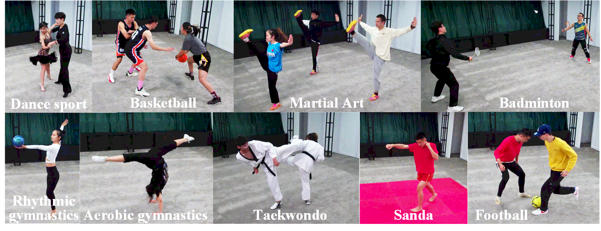

## MegaPose v1: A Large-Scale Multi-View Sports Video Dataset for 3D Human Pose Estimation
We present our ongoing effort of constructing a large-scale multi-view sports video dataset for 3D human pose estimation, named MegaPose.

## Introduction
Adopting deep learning in human position estimation(HPE) become mainstream these days. However, the 3D-HPE dataset with high quality and vast subjects is still deficient, which undoubtfully impedes the development of 3D-HPE since deep learning is heavily data-oriented. With the purpose of enlightening the others, we introduce the 3D-HPE dataset MegaPose, a large-scale multi-view sports video dataset for 3D HPE. MegaPose aims to provide diversified and high-quality video data from 12 views, which consists of both indoor and outdoor scenarios, as well as single and multi-person scenarios of various sports.  As the first version of the dataset, MegaPose v1, including indoors from 51 subjects for 9 different sports including football, basketball, badminton, rhythmic gymnastics, dancesport, aerobic gymnastics, martial art, sanda, and taekwondo. It contains 228 video clips constituting a total of 7.26 million frames. Figure 1 shows example images of 9 kinds of sports in MegaPose v1.

  

